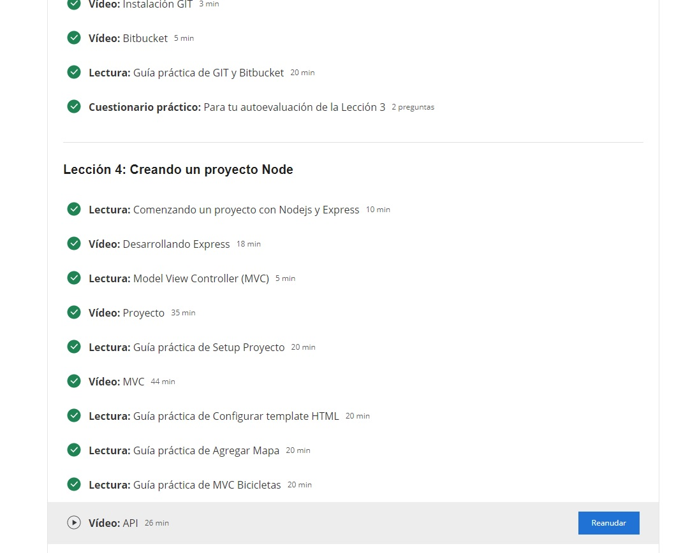

# Programación Orientada a Objetos: EN CASA

En este repositorio publicarás los ejercicios del curso de COURSERA que elegiste para trabajar desde tu casa.

Deberás hacer publicaciones (commit/push) de manera frecuente, por lo menos uno por cada sesión de trabajo para poder ir viendo tus avances.

Para mejor referencia actualiza este archivo con los siguientes datos:

# Información General

Nombre del curso: Desarrollo del lado del servidor: NodeJS, Express y MongoDB

# Imagenes De Avances del Curso:

Semana 2

